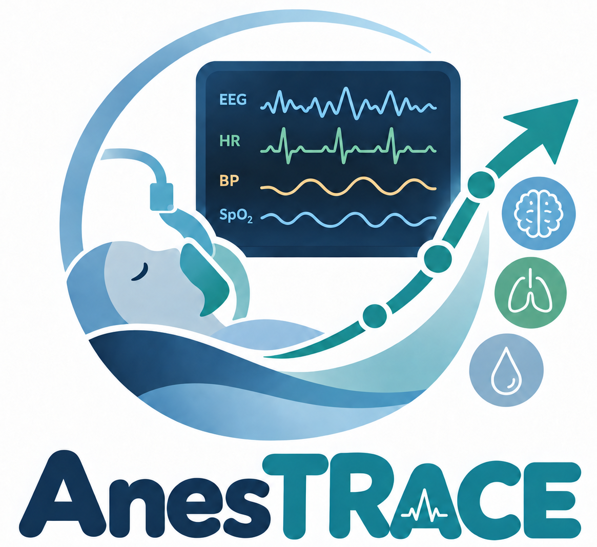
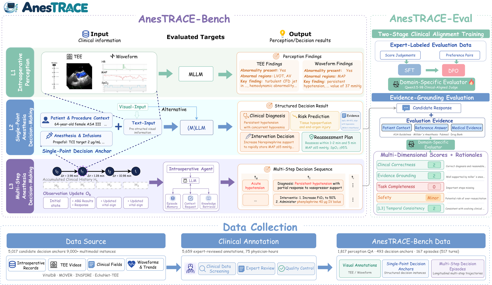
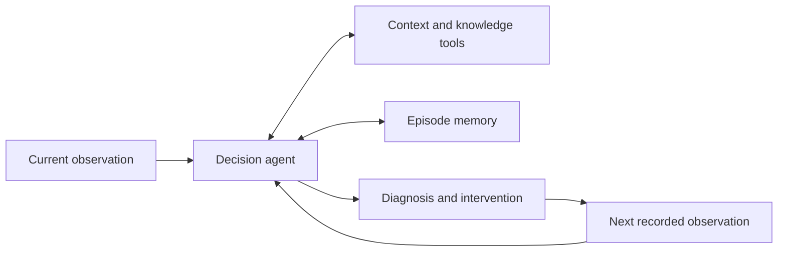

<div align="center">
  

  # AnesTRACE: Benchmarking Intraoperative Anesthesia from Multimodal Perception to Multi-step Decision-Making

  Ziwei Huang<sup>1</sup>, Qi Gao<sup>2</sup>, Zhe Ji<sup>3,*</sup>, Yuanyuan Yao<sup>2</sup>, Fengjiang Zhang<sup>2</sup>, Min Yan<sup>2,✉</sup>, Zhongle Xie<sup>1,✉</sup>, Gang Chen<sup>1</sup>

  <sup>1</sup> Zhejiang University · <sup>2</sup> The Second Affiliated Hospital of Zhejiang University · <sup>3</sup> Central South University

  <sup>*</sup> Work done while at Zhejiang University.

  [](https://arxiv.org/abs/2609.32740)
  [](https://zjudbxai.github.io/AnesTRACE/)
  [](https://huggingface.co/DataXAI/AnesTRACE-Eval)
  [](LICENSE)
</div>

## News

- **2026.09:** The [AnesTRACE preprint](https://arxiv.org/abs/2609.32740) was posted on arXiv.

## Overview

AnesTRACE evaluates intraoperative perception, single-point anesthesia decisions, and multi-step decision updating on recorded clinical trajectories. AnesTRACE-Eval assesses open-ended decisions. The benchmark is for **research evaluation only**, not clinical use or deployment qualification.



## What We Release

This repository contains inference runners, the L3 tool-gated Agent, reference-based scoring interfaces, evaluator configuration, synthetic examples, and the project website. **Benchmark cases, patient records, gold answers, source-derived media, restricted knowledge corpora, and model weights are not included.** Synthetic scores demonstrate interfaces only; they are **not official benchmark scores**.

The paper includes historical API-based baselines. New official submissions are limited to models whose fixed weights can run locally in the team's environment; these are distinct evaluation conditions.

```text
AnesTRACE/
├── benchmarks/
│   ├── common/              # Shared local multimodal adapter
│   ├── perception/          # L1 inference, metrics, prompts, tests
│   ├── single_point/        # L2 text and multimodal runners, judge, tests
│   └── multi_step/          # L3 runner, judge, installable agent
├── evaluation/config/       # Public evaluator prompt contracts
├── examples/synthetic/      # Artificial inputs and smoke checks
├── data/README.md           # Data nonrelease and submission policy
├── docs/                    # GitHub Pages site and published leaderboard
└── requirements.txt
```

## Installation

Python 3.10+ is required:

```bash
python -m venv .venv
source .venv/bin/activate
pip install -r requirements.txt
pip install -e 'benchmarks/multi_step/agent[test]'
```

L1/L2 visual inference requires a compatible local checkpoint containing `config.json` and processor files. Video inference additionally requires `opencv-python`. The L3 Agent uses an OpenAI-compatible **local model server**; see the [Agent guide](benchmarks/multi_step/agent/README.md). API-compatible transport does not imply hosted API models are accepted for new submissions.

## Inference

Provide an authorized input or use the artificial examples. Local model paths below are placeholders for checkpoints you control.

Run weight-free input smoke checks first:

```bash
python benchmarks/perception/inference/run.py --language en \
  examples/synthetic/perception.jsonl --validate-input-only
python benchmarks/single_point/inference/run_text.py \
  examples/synthetic/single_point.jsonl --language en --validate-input-only
python benchmarks/single_point/inference/run_multimodal.py \
  examples/synthetic/single_point_multimodal.jsonl --validate-input-only
anestrace-l3 validate --input examples/synthetic/multi_step.jsonl
```

```bash
# L1: TEE or monitoring-image inference
python benchmarks/perception/inference/run.py --language en \
  examples/synthetic/perception.jsonl --model-path /path/to/local-vlm \
  --output outputs/synthetic-l1.jsonl

# L2: standardized text evidence
python benchmarks/single_point/inference/run_text.py \
  examples/synthetic/single_point.jsonl --language en \
  --model-path /path/to/local-llm --output outputs/synthetic-l2.jsonl

# L2: paired visual evidence (input-validation smoke check)
python benchmarks/single_point/inference/run_multimodal.py \
  examples/synthetic/single_point_multimodal.jsonl \
  --model-path /path/to/local-vlm --validate-input-only

# L3: validate an episode, then use your local server
anestrace-l3 validate --input examples/synthetic/multi_step.jsonl
anestrace-l3 --config benchmarks/multi_step/agent/configs/default.json run \
  --input examples/synthetic/multi_step.jsonl \
  --api-base http://127.0.0.1:8002/v1 --model local-model-id \
  --output-dir outputs/synthetic-l3
```



The environment replays recorded observations; a model recommendation does not change later patient states.

## Evaluation

Download the separately released evaluator checkpoint:

```bash
pip install -U huggingface_hub
hf download DataXAI/AnesTRACE-Eval --local-dir checkpoints/anestrace-eval
```

These **synthetic** commands verify public formats and scoring paths, not paper leaderboard results:

```bash
python benchmarks/perception/evaluation/evaluate.py \
  --gold examples/synthetic/perception_gold.jsonl \
  --predictions examples/synthetic/perception_predictions.jsonl --profile tee

python benchmarks/single_point/evaluation/evaluate.py \
  --gold examples/synthetic/single_point_gold.jsonl \
  --predictions examples/synthetic/single_point_predictions.jsonl \
  --system-prompt evaluation/config/anestrace_eval_overall_system_en.txt \
  --model checkpoints/anestrace-eval --validate-input-only

python benchmarks/multi_step/evaluation/evaluate.py \
  --gold examples/synthetic/multi_step.jsonl \
  --predictions examples/synthetic/multi_step_predictions.jsonl \
  --model checkpoints/anestrace-eval --dry-run
```

Omit the validation or dry-run flag to invoke the downloaded judge. Clinician-annotated references and adjudicated criteria remain private; only the team calculates **official** scores. The bundled generic triplet extractor is for interface testing and is not a substitute for the frozen clinical reference annotations.

Public tests:

```bash
python -m unittest discover -s benchmarks/perception/tests -v
python -m unittest discover -s benchmarks/single_point/tests -v
cd benchmarks/multi_step/agent && PYTHONPATH=src python -m pytest
```

## Model Submission

For private, team-run evaluation, contact **[ziweihuang@zju.edu.cn](mailto:ziweihuang@zju.edu.cn)**. Include the fixed model repository and revision, weight-access procedure, tokenizer/chat template, license, and hardware/runtime requirements. **Do not email weight files or post private weights, credentials, or patient data in GitHub Issues.** We currently accept only checkpoints executable locally in the team's environment; the team confirms feasibility before evaluation.

## Data Availability

Benchmark data are **not currently provided**. See [data/README.md](data/README.md) for the release boundary and source-dataset terms.

## Citation

```bibtex
@misc{huang2026anestrace,
  title={AnesTRACE: Benchmarking Intraoperative Anesthesia from Multimodal Perception to Multi-step Decision-Making},
  author={Huang, Ziwei and Gao, Qi and Ji, Zhe and Yao, Yuanyuan and Zhang, Fengjiang and Yan, Min and Xie, Zhongle and Chen, Gang},
  year={2026},
  eprint={2609.32740},
  archivePrefix={arXiv},
  url={https://arxiv.org/abs/2609.32740}
}
```

The MIT license applies to original code only. Institution marks and third-party artwork retain their own rights and are **not licensed for reuse** by this repository's code license.
